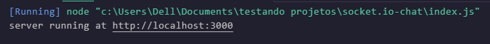

# Inicialização do projeto

O primeiro passo é criar uma simples página HTML que exiba o formulário e uma lista de mensagens. 

Usaremos o framework web Node.JS express para isso. Certifique-se que o *Node.JS* está instalado.

## Criando o package.json

Primeiro, vamos criar um package.json que descreve nosso projeto:

```json
{
  "name": "socket-chat",
  "version": "0.0.1",
  "description": "my first socket.io app",
  "type": "module",
  "dependencies": {}
}
```
💡 Recomenda-se colocar em um diretório vazio dedicado (socket-chat)

⚠️ Atenção: A propriedade "name" deve ser única. Você não pode usar um valor como "socket.io" ou "express", porque o npm reclamará ao instalar a dependência.

## Depois de instalado, podemos criar um index.js que configurará nosso aplicativo
```
import express from 'express';
import { createServer } from 'node:http';

const app = express()
const server = createServer(app);

app.get('/', (req), res)=>{
	res.send('<h1>Hellow World!</h1>');
	});

server.listen(3000, ()=>{
	console.log('server runing at http://localhost:3000');
	});
```
Isso significa que o Express é iniciado para ser um manipulador de funções que você pode fornecer a um servidor HTTP

Definimos um manipulador de rotas ‘/’ que é chamado quando acessamos a página inicial do nosso projeto

Fizemos o servidor http rodar na porta 3000

Se executar o node index,js deverá aparecer o seguinte:


E se acessar http://localhost:3000: no navegador teremos :


## Gerenciando dependências e arquivos ignorados

Ao executar npm install, o NPM cria a pasta node_modules com todas as dependências. Por boas práticas:

### O que você deve fazer:

**Crie um arquivo `.gitignore`** na raiz do projeto com:
   ```gitignore
  # Dependências
node_modules/

# Ambiente
.env
.env.local

# Logs e temporários
*.log
npm-debug.log*
.DS_Store

# IDEs/Editores
.idea/
.vscode/
*.swp

# Sistema operacional
Thumbs.db
```
Execute no terminal para limpar o cache:
```
git rm -r --cached node_modules/
git commit -am "Remove node_modules from tracking"
```